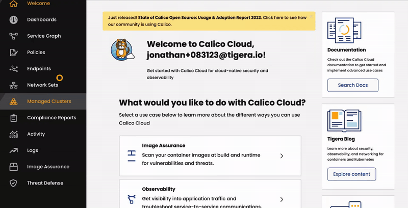

# Connecting Kubernetes to Sanctioned SaaS: Utilizing Calico's Egress Gateway for AWS

Organizations often use IP allowlisting for enhanced security with their cloud applications. Many cloud applications limit access based on the source IP. To communicate with these services, your traffic must come from a pre-registered IP. Otherwise, access is denied.

With Calico Egress Gateways for AWS, you can dictate the public source IP for Kubernetes workload traffic bound for the internet. This is achieved by associating AWS Elastic IP addresses with Kubernetes namespaces and pods. Calico manages this in the background, ensuring that egress traffic from these workloads always uses one of the known public IPs.

[Calico Egress Gateways](https://www.tigera.io/tigera-products/egress-gateway/) guarantee that traffic from your Kubernetes setup (like an Elastic Kubernetes Service cluster) to external platforms consistently originates from certain IP addresses. This is essential when dealing with services that use IP allowlisting for security.

## Solution Overview

This guide will show you how to integrate Calico's Custom Resources with AWS Elastic IP addresses using an Infrastructure as Code (IaC) pattern. This integration will automate public IP allocation for Kubernetes workloads connecting to approved SaaS platforms.

## Walk Through

We'll use Terraform, an infrastructure-as-code tool, to deploy this reference architecture automatically. We'll walk you through the deployment process and then demonstrate how to utilize [Egress Gateways with Calico on AWS](https://docs.tigera.io/calico-cloud/networking/egress/egress-gateway-aws).

### Prerequisites

First, ensure that you have installed the following tools locally.

1. [aws cli](https://docs.aws.amazon.com/cli/latest/userguide/getting-started-install.html)
2. [kubectl](https://Kubernetes.io/docs/tasks/tools/)
3. [terraform](https://learn.hashicorp.com/tutorials/terraform/install-cli)

### Step 1: Checkout and Deploy the Terraform Blueprint

#### 1. Clone the Terraform Blueprint
Make sure you have completed the prerequisites and then clone the Terraform blueprint:
```sh
git clone git@github.com:tigera-solutions/calico-egress-gateway-public-ip-anchoring.git
```

#### 2. Navigate to the AWS Directory
Switch to the `aws` subdirectory:
```sh
cd aws
```

#### 3. Customize Terraform Configuration
Optional: Edit the [variables.tf](aws/variables.tf) file to customize the configuration.

#### 4. Deploy the Infrastructure
Initialize and apply the Terraform configurations:
```sh
terraform init
terraform apply
```

#### 5. Update Kubernetes Configuration
Update your kubeconfig with the EKS cluster credentials as indicated in the Terraform output:
```
aws eks --region us-east-1 update-kubeconfig --name demo --alias demo
```

#### 6. Verify Calico Installation
Check the status of Calico in your EKS cluster:
```
kubectl get tigerastatus
```

### Step 2: Link Your EKS Cluster to Calico Cloud

#### 1. Join the EKS Cluster to Calico Cloud
Join your EKS cluster to [Calico Cloud](https://www.calicocloud.io/home) as illustrated:



#### 2. Verify the Cluster Status
Check the cluster status:
```sh
kubectl get tigerastatus
```

## Step 3: Configure Enterprise-grade Egress Gateways for AWS Elastic Kubernetes Service

#### 1. Update the Felix Configuration
Enable egress IP support, AWS secondary IP support, and set the flow logs flush interval:
```sh
kubectl patch felixconfiguration default --type='merge' -p '{
  "spec": {
    "egressIPSupport": "EnabledPerNamespaceOrPerPod",
    "awsSecondaryIPSupport": "Enabled",
    "flowLogsFlushInterval": "15s",
    "flowLogsFileAggregationKindForAllowed": 1
  }
}'
```

#### 2. Go to the Kubernetes Directory
Change to the `k8s` directory:
```sh
cd k8s
```

#### 3. Review the Variables Configuration
Examine the [variables.tf](k8s/variables.tf) file for Calico Egress Gateways settings.

#### 4. Deploy Egress Gateways
Use Terraform to create six egress gateways, ensuring that each gateway has only one replica:
```sh
terraform init
terraform apply --auto-approve \
  --var egress_gateway_replica_count="1" \
  --var egress_gateway_count="6"
```

## Validate the Deployment and Review the Results

#### 1. Deploy Netshoot Pod and Calico NetworkSets
Return to the project root and apply the manifests:
```sh
cd ..
kubectl apply -f manifests
```

#### 2. Implement Calico Egress Gateway Source-Based Routing
Test the configuration of each Egress Gateway:
```sh
for egw in {1..3}; do
    echo -n "Elastic IPs for EGW-${egw}: "
    kubectl get egressgateway egw-${egw} -o json | jq -r '.spec.aws.elasticIPs[]'
    
    kubectl annotate pod netshoot --overwrite egress.projectcalico.org/selector="egress-gateway == 'egw-${egw}'"

    echo -n "Public IP for netshoot pod via EGW-${egw}: "
    kubectl exec -it netshoot -- curl ifconfig.me
    echo
    echo "----------"
    echo
done
```
We connect the netshoot pod to each egress gateway, one after another. After each connection, we use a website called `ifconfig.me` to see what IP address it recognizes as coming from us. This website acts like a mirror, showing us the IP address we're using. By doing this, we can clearly see that we have control over setting the public IP address for the outgoing traffic from a specific pod or namespace.

Use the Calico Cloud Dynamic Service Graph to monitor the traffic originating from your workloads as it passes through the egress gateways and travels over the internet to reach `ifconfig.me`.

https://github.com/tigera-solutions/calico-egress-gateway-public-source-ip-anchoring/assets/101850/9bea7229-2b7f-4c64-9b1f-a9b5a144f4f5


#### 3. Implement Calico Egress Gateway Policy-Based Routing
Apply the Egress Gateway policy, and then annotate the default namespace to utilize this policy.
```sh
kubectl apply -f manifests/egw-policy.yaml
kubectl annotate ns default egress.projectcalico.org/egressGatewayPolicy="egress-gateway-policy"
```

#### 3. Review the Egress Gateway Policy Configuration
Check the [egw-policy.yaml](manifests/egw-policy.yaml) file to understand how traffic is directed.

#### 4. Verify Egress Traffic
Test egress traffic from the netshoot pod:
```sh
kubectl exec -it netshoot -- ping -c 2 8.8.8.8
kubectl exec -it netshoot -- ping -c 2 4.2.2.2
kubectl exec -it netshoot -- ping -c 2 8.8.4.4
```
Traffic sent to 8.8.8.8 will be routed through `egw-5`, while traffic to 4.2.2.2 will go through `egw-6`. Any traffic to destinations other than these will default to using `egw-4`. This setup showcases our ability to manage the public source IP address for Kubernetes egress traffic from specific namespaces and pods, controlled through policy settings.

Use the Calico Cloud Dynamic Service Graph to observe and track the traffic flow from your workloads as it is routed through the egress gateways according to the defined policy.

https://github.com/tigera-solutions/calico-egress-gateway-public-source-ip-anchoring/assets/101850/23c36a56-02bf-46ea-8990-e101aa11e3dd


#### 5. Reset and Repeat
Reset the configurations and repeat the process if needed:
```sh
kubectl annotate ns default egress.projectcalico.org/egressGatewayPolicy-
kubectl annotate pod netshoot egress.projectcalico.org/selector-
```

#### 6. Cleanup

To teardown and remove the resources created in this example:

```sh
cd aws
terraform destroy --auto-approve
```
